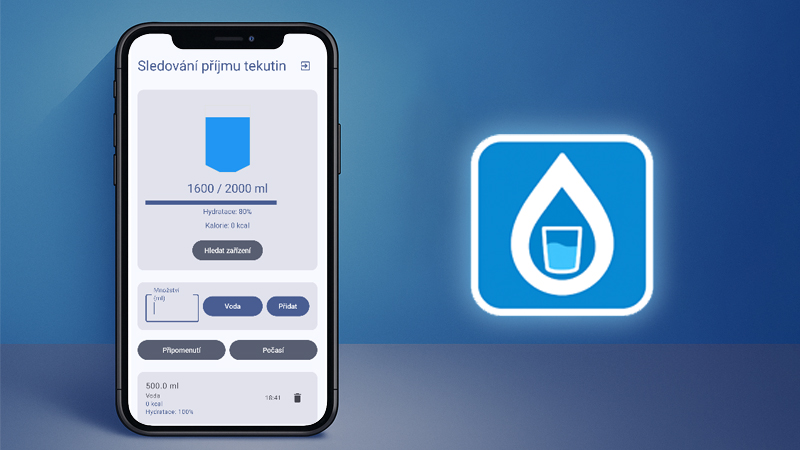

# 🥤 Aplikace pro sledování příjmu tekutin

Sledujte svůj denní příjem tekutin a udržujte si optimální hydrataci díky chytré a přehledné aplikaci, která bere v potaz nejen množství, ale i typ nápoje, kalorickou hodnotu a dokonce i aktuální počasí.

---

## 🚀 Klíčové funkce

- 🎯 **Nastavení denního cíle** – každý uživatel si může přizpůsobit svůj cíl podle svých potřeb.
- 📈 **Přehledný vizuální ukazatel** – sledujte v reálném čase, kolik tekutin jste už přijali v mililitrech.
- 🧃 **Záznam různých typů nápojů** – voda, čaj, káva, džusy a další.
- 🔥 **Výpočet kalorií** – evidujte nejen objem, ale i kalorickou hodnotu nápojů.
- 💧 **Hodnocení hydratace** – aplikace rozlišuje mezi nápoji podle jejich hydratačního efektu.
- ☀️ **Integrace s API pro počasí** – příjem tekutin je upravován podle denní teploty a vlhkosti.

---
